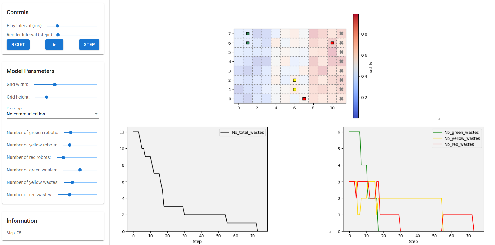

# Self-Organization of Robotic Agents in Hostile Environments

## 1. Introduction

This project aims to simulate the self-organization of heterogeneous robot agents tasked with handling hazardous waste in a radioactive environment. Each robot has specific capabilities and zone restrictions, and operates autonomously using agent-based modeling to perceive, reason, and act. The objective is to explore and evaluate both the strategy without communication between agents and the strategy with communication.


## 2. Git Structure

- `MAS/`
   - `agents/` - Contains different versions of robot agent implementations.
   - `model.py` - Defines the RobotMission model, including environment setup, agent behavior, and waste management.
   - `objects.py` - Defines static elements, including waste items, radioactive zones, and disposal sites.
   - `actions.py` - Manages robot actions, including movement, waste pickup, combination, and disposal.
   - `run.py` – A test script for manually running the simulation model, primarily used for debugging.
   - `server.py` - Handles real-time visualization and simulation monitoring.
- `MAS_evaluation.ipynb` – Evaluates and compares the performance of different strategies.


## 3. Simulation Parameters & Modes
The simulation models an environment divided into three zones—low, medium, and high radioactivity—where robots:

- Collect and combine waste items (green, yellow, red)
- Navigate a grid-based environment with customizable dimensions
- Operate in either communication-enabled or communication-free configurations

The system is designed to be modular and highly configurable. Users can adjust a wide range of parameters in real time through the simulation interface:



- **Environment Parameters:**
  - **Grid Size:** Adjustable (e.g., standard 12×8, large 24×16)
  - **Radioactivity Levels:** Automatically defined for each zone (low, medium, high)

- **Agent Parameters:**
  - **Number and Types of Robots:** Flexible configuration (e.g., Green: 2, Yellow: 2, Red: 2)
  - **Waste Quantities:** Varying numbers of green, yellow, and red waste items

- **Model Modes:**
  - **No Communication:** Robots act independently without sharing information
  - **With Communication:** Robots exchange messages to coordinate and improve collection efficiency

These parameters can be easily modified using the controls (sliders and dropdown menus) in the simulation’s interface (see the [Visualization](Visualization) section).


## 4. Visualization
Our simulation provides a real-time visual interface to observe the behavior of the agents and the results of the simulation. We visualize two key components : 

- **Grid Visualization:** 

   The environment is represented as a grid, displaying robots, waste items, and disposal zones. The radioactivity level in each grid cell is represented using color gradients. 

   

  - **Wastes:** Displayed as full circles (disks) with colors indicating their type.
  - **Robots:** Shown as squares with colors specific to each robot type.
    - When a robot is carrying a single waste, its shape changes to a **diamond** .
    - When carrying a combined waste, the shape changes to a **pentagon**.
  
- **Performance Metrics Dashboard:** 

   In addition to the grid visualization, our simulation features a real-time performance metrics dashboard. This dashboard comprises two graphs:

   

   - **Simulation Steps:** A graph that dynamically displays the total number of steps taken during the simulation. This metric provides insight into the progression and speed of the simulation.

   - **Waste Distribution:** A graph that shows the real-time count of waste items by category (green, yellow, red). This visualization helps track how waste collection, transformation, and disposal evolve over time.

These components allow us to monitor key performance indicators and evaluate the efficiency of the robot agents' behavior throughout the simulation.


## 5. Robot Behavior Strategies

### 5.1 Agent Inheritance Structure
---

The diagram below shows the class inheritance structure of the robot agents.


### 5.2 No-Communication Strategy
---

In this phase, the agents operate independently based on their local perceptions without inter-agent communication.

At the beginning, each robot moves randomly within its designated zone. If a robot detects a waste item of its type in the current cell and has capacity, it will pick it up. Once it collects two wastes of the same type, it combines them into a higher-level waste. After combining, the robot resumes random movement. When it reaches the eastern boundary of its zone, it drops the combined waste, allowing the next-tier robot to pick it up and continue the process. Red robots, however, drop red waste directly into a disposal zone. 

After this initial implementation, several enhancements were introduced to improve the robots' efficiency:

1. **Enhanced Random Exploration:**  
   The exploration was refined so that a robot chooses the least-explored neighboring cell based on its local visit memory, thereby reducing redundant movements.

2. **Target Waste Behavior:**  
   Robots now prioritize moving towards waste items that they have previously perceived rather than continuing random exploration, ensuring quicker collection of available waste.

3. **Improved Movement Towards the Border:**  
   Once a robot successfully combines two wastes, it immediately moves toward the boundary of its zone to drop the combined waste without delay.

4. **Handling Non-Converging Instances:**  
   To address cases where two robots of the same type each hold one waste and are unable to combine them, we implemented:
   - **Hold Timer and Drop:**  
     Robots now drop uncombined waste after a maximum holding time (e.g., 30 steps) at either the zone border or the original pickup location.
   - **Cooldown After Drop:**  
     After dropping a waste, a robot will not re-pick the same waste for a few steps (e.g., 15 steps) to avoid infinite drop-pick cycles.

With these improvements, our simulation metrics showed significant enhancement, achieving a 100% termination rate even without communication between agents when running the simulations for infinite number of steps.


### 5.3 Cooperative Strategy with Communication
---

In this phase, communication between agents is key to optimizing the waste collection and combination process. Each robot can send and receive messages to/from other agents, enabling dynamic cooperation. For example, a typical Green-Green interaction is shown in the figure below.


There are mainly three stages:

1. **Broadcasting Pick-Up Intentions:** <br>
   When a robot (e.g., Green robot) successfully picks up a waste and holds exactly one, it broadcasts an `INFORM_REF` message to its group (e.g., all Green robots). This message signals that it is looking for a partner to combine with.

2. **Proposal and Negotiation for Combination:** <br>
   Upon receiving a broadcast indicating that a robot is holding one waste and looking for a partner, another eligible robot (also holding one waste and not currently in a collaboration) responds by sending a `PROPOSE` message. The original sender can then respond with an `ACCEPT`, including its current position as the target location for combining. The following mechanisms are also implemented:
   
   - **Timeout Mechanism:** <br>
     If no agreement is reached within a few steps, the negotiation is automatically canceled. This prevents robots from remaining idle due to stalled negotiations.
   
   - **Tie-Breaking Rule:** <br>
     If two robots send `PROPOSE` messages to each other at the same step, a tie-breaking rule is applied. The robot with the **lower numeric ID** (e.g., `GreenRobot_1` vs. `GreenRobot_2`) has priority and sends the `ACCEPT`, while the other waits.

   The two robots then synchronize their positions. One robot drops its waste at the target location, and the other moves there to pick it up. A combination then takes place. The newly combined waste is carried to the border and dropped.

3. **Informing the Next Group:** <br>
   After dropping the combined waste at the border between zones, the robot broadcasts the drop location to the next level of robots (e.g., Green robots inform Yellow robots about a new yellow waste). The receiving robots update their knowledge with the new waste location, allowing them to continue the mission efficiently.

This communication-based strategy allows agents to form temporary partnerships, coordinate actions, and minimize redundant movements.


## 6. Model Evaluation & Results

### Evaluation Protocol
To assess the performance of our models, we run a fixed number of simulation iterations (`N`) for each configuration. For every configuration, we measure two key metrics:
- **Average Score (steps):** The average number of steps needed to finish the mission (computed only for converged cases).
- **Termination Rate (%):** The percentage of simulation runs that successfully terminated within a predefined maximum number of steps. Each simulation is run for a maximum of `max_steps` steps, beyond which it is considered non-convergent.

### Evaluation Parameters
The following table summarizes the parameters used across all evaluations:

| Case      | Grid Size | Robot Composition         | Waste Composition         | N (simulations) | max_steps |
|-----------|-----------|---------------------------|---------------------------|-----------------|-----------|
| **Case 1** | 12×8      | 6 Robots (G:2, Y:2, R:2)   | 12 Wastes (G:6, Y:3, R:3)  | 100           | 1000 |
| **Case 2** | 12×8      | 3 Robots (G:1, Y:1, R:1)   | 12 Wastes (G:6, Y:3, R:3)  | 100           | 1000 |
| **Case 3** | 24×16     | 12 Robots (G:4, Y:4, R:4)  | 24 Wastes (G:10, Y:9, R:5) | 100           | 1000 |

---

### 6.1. No Communication Strategy

#### Initial Evaluation (Before Handling Divergent Cases)
| Model Configuration | Average Score (steps) | Termination Rate (%) |
|---------------------|-----------------------|----------------------|
| **Case 1**        | 59.03                  | 36.00%                |
| **Case 2**        | 101.15                | 100.00               |
| **Case 3**        | 153.00                | 6.00%                 |


*Note: Divergent cases occurred when matching wastes were held by different robots, preventing mission termination.*

#### Updated Evaluation (After Implementing Drop Mechanism)
| Model Configuration   | Average Score (steps) | Termination Rate (%) |
|--------|-----------------------|----------------------|
| **Case 1**  | 103.02                 | 95.00%               |
| **Case 2**  | 95.27                 | 100.00               |
| **Case 3**  | 393.65                | 88.00%               |

The introduction of the drop mechanism significantly improved the termination rate by addressing various non-convergent cases.

Moreover, by increasing the `max_steps` parameter (or setting it to an infinite number of steps), the termination rate reaches 100% across all configurations.


### 6.2. Cooperative Strategy with Communication
*Results for the Cooperative Strategy with Communication will be included here once the experiments are completed. Preliminary observations indicate improvements in task coordination, and detailed metrics will be added in subsequent updates.*


## 7. Running the simulations

1. Clone the repository  
   ```sh
   git clone https://gitlab-student.centralesupelec.fr/marius.nadalin/mas_self_org_robots_in_host_env.git
   cd mas_self_org_robots_in_host_env

2. Install dependencies  
   ```sh
   pip install -r requirements.txt

3. Run the server
   ```sh
   solara run MAS/server.py

**Notes:**

Adjust simulation parameters (number of robots, waste quantities, grid size, and model mode) via the provided configuration options or GUI controls.

To run the evaluation notebook, open `MAS_evaluation.ipynb` and follow the instructions.


## Contact
- ZUO Yuxian – yuxian.zuo@student-cs.fr
- NADALIN Marius – marius.nadalin@student-cs.fr
- EL BARHICHI Mohammed – mohammed.elbarhichi@student-cs.fr