# Self-Organization of Robotic Agents in Hostile Environments

## 1. Introduction

This project aims to simulate the self-organization of heterogeneous robot agents tasked with handling hazardous waste in a radioactive environment. Each robot has specific capabilities and zone restrictions, and operates autonomously using agent-based modeling to perceive, reason, and act. The objective is to explore and evaluate both the strategy without communication between agents and the strategy with communication.


## 2. Git Structure

- `MAS/`
   - `agents/` - Contains different versions of robot agent implementations.
   - `model.py` - Defines the RobotMission model, including environment setup, agent behavior, and waste management.
   - `objects.py` - Defines static elements, including waste items, radioactive zones, and disposal sites.
   - `actions.py` - Manages robot actions, including movement, waste pickup, combination, and disposal.
   - `test.py` – A test script for manually running the simulation model, primarily used for debugging.
   - `server.py` - Handles real-time visualization and simulation monitoring.
- `MAS_evaluation.ipynb` – Evaluates the performance of different strategies.
- `MAS_results_analysis.ipynb` – Analyses the results and compares the performance of different strategies.
- `benchmarks/` - Contains different variations of evaluation results as csv files.


## 3. Running the Simulation

1. Clone the repository  
   ```sh
   git clone https://gitlab-student.centralesupelec.fr/marius.nadalin/mas_self_org_robots_in_host_env.git
   cd mas_self_org_robots_in_host_env

2. Install dependencies  
   ```sh
   pip install -r requirements.txt

3. Run the server
   ```sh
   solara run MAS/server.py

**Notes:**
- Adjust simulation parameters (number of robots, waste quantities, grid size, and model mode) via the provided configuration options or GUI controls.
- To run the evaluation notebook, open `MAS_evaluation.ipynb` and follow the instructions.


## 4. Simulation Parameters & Modes
The simulation models an environment divided into three zones—low, medium, and high radioactivity—where robots:

- Collect and combine waste items (green, yellow, red)
- Navigate a grid-based environment with customizable dimensions
- Operate in either communication-enabled or communication-free configurations

The system is designed to be modular and highly configurable. Users can adjust a wide range of parameters in real time through the simulation interface:

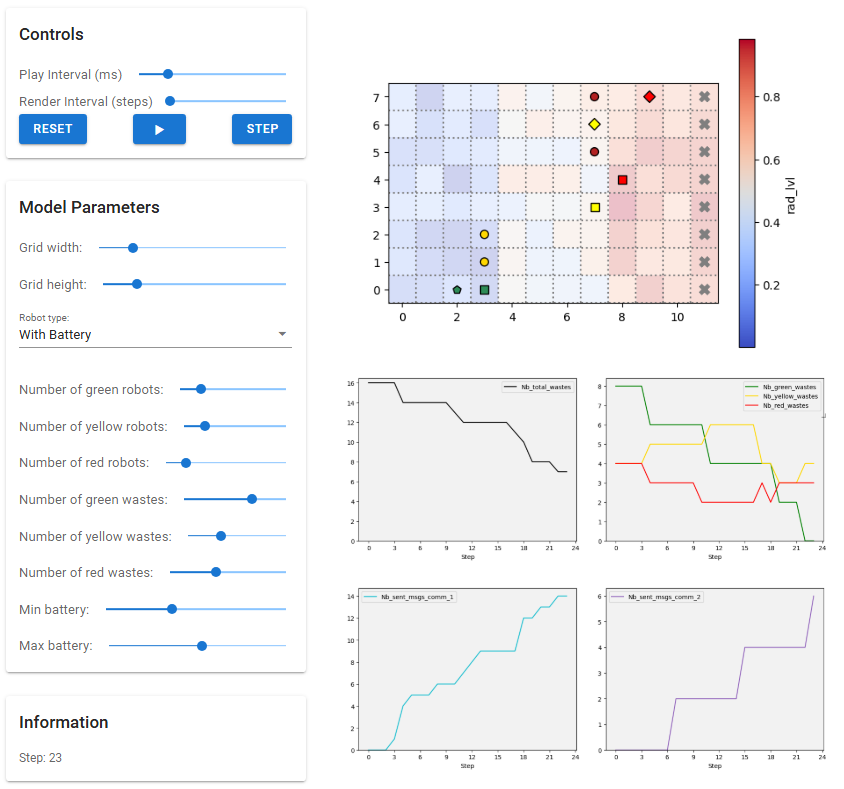

- **Environment Parameters:**
  - **Grid Size:** Adjustable (e.g., standard 12×8, large 24×16)
  - **Radioactivity Levels:** Automatically defined for each zone (low, medium, high)

- **Agent Parameters:**
  - **Number and Types of Robots:** Flexible configuration (e.g., Green: 2, Yellow: 2, Red: 2)
  - **Waste Quantities:** Varying numbers of green, yellow, and red waste items

- **Model Modes:**
  - **No Communication:** Robots act independently without sharing information
  - **With Communication:** Robots exchange messages to coordinate and improve collection efficiency
  - **With Battery:** Robots start with a random limited battery capacity.

These parameters can be easily modified using the controls (sliders and dropdown menus) in the simulation’s interface (see the [Visualization](Visualization) section).


## 5. Visualization
Our simulation provides a real-time visual interface to observe the behavior of the agents and the results of the simulation. We visualize two key components : 

- **Grid Visualization:** 

   The environment is represented as a grid, displaying robots, waste items, and disposal zones. The radioactivity level in each grid cell is represented using color gradients. 

   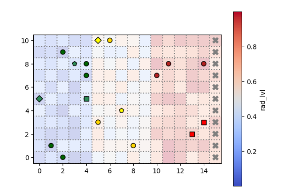

  - **Wastes:** Displayed as full circles (disks) with colors indicating their type.
  - **Robots:** Shown as squares with colors specific to each robot type.
    - When a robot is carrying a single waste, its shape changes to a **diamond** .
    - When carrying a combined waste, the shape changes to a **pentagon**.
  
- **Performance Metrics Dashboard:** 

   In addition to the grid visualization, our simulation features a real-time performance metrics dashboard. This dashboard comprises two graphs:

   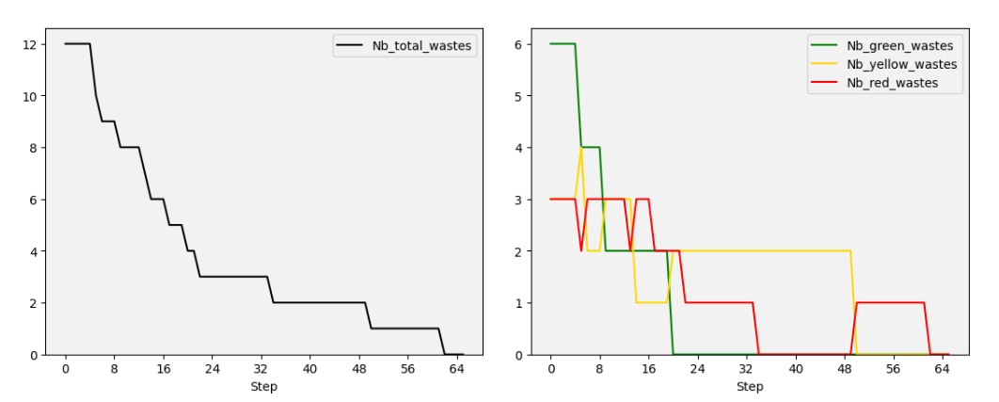

   - **Waste Distribution:** A graph that shows the real-time count of waste items by category (green, yellow, red). This visualization helps track how waste collection, transformation, and disposal evolve over time.

   - **Total Waste Count:** A graph displaying the total number of waste objects still present in the environment (i.e., not yet destroyed). This gives a quick, high‑level view of overall cleanup progress.

- **Communication Metrics Dashboard:**  

   In addition to the performance dashboards, when we are using the protocol of communication, we track the communication volumes in real time via two additional graphs:

   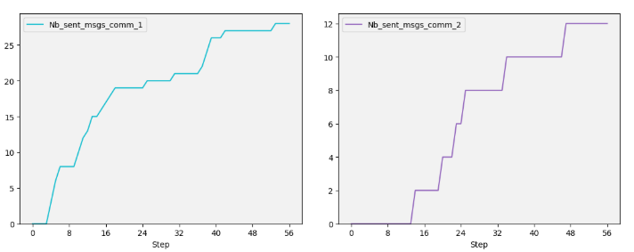
 
   - **Communication 1 (comm_1):** A graph that shows the real time count of Intra‑team messages per step—messages exchanged between robots of the same color to coordinate locally.
  
   - **Communication 2 (comm_2)** A graph that shows the real time count of Inter‑tier (comm2) handoff notifications per step—messages sent from one robot tier (e.g. green) to the next (e.g. yellow) when a waste item is combined and droped.

   These communication graphs reveal both intra‑team coordination efforts and the inter‑tier handoff notifications that underpin the end‑to‑end waste transfer pipeline.


These components allow us to monitor key performance indicators and evaluate the efficiency of the robot agents' behavior throughout the simulation.


## 6. Robot Behavior Strategies

### 6.1. Agent Inheritance Structure


The diagram below shows the class inheritance structure of the robot agents.

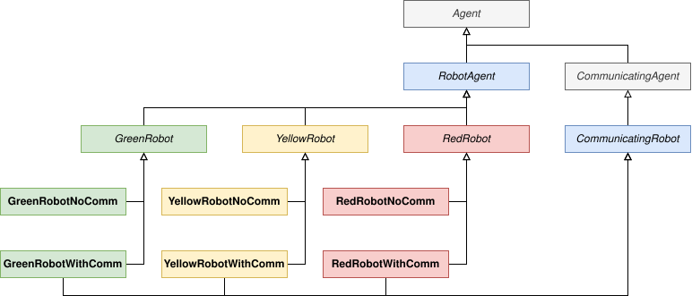


### 6.2. No-Communication Strategy


In this phase, the agents operate independently based on their local perceptions without inter-agent communication.

At the beginning, each robot moves randomly within its designated zone. If a robot detects a waste item of its type in the current cell and has capacity, it will pick it up. Once it collects two wastes of the same type, it combines them into a higher-level waste. After combining, the robot resumes random movement. When it reaches the eastern boundary of its zone, it drops the combined waste, allowing the next-tier robot to pick it up and continue the process. Red robots, however, drop red waste directly into a disposal zone. 

After this initial implementation, several enhancements were introduced to improve the robots' efficiency:

1. **Enhanced Random Exploration:**  
   The exploration was refined so that a robot chooses the least-explored neighboring cell based on its local visit memory, thereby reducing redundant movements.

2. **Target Waste Behavior:**  
   Robots now prioritize moving towards waste items that they have previously perceived rather than continuing random exploration, ensuring quicker collection of available waste.

3. **Improved Movement Towards the Border:**  
   Once a robot successfully combines two wastes, it immediately moves toward the boundary of its zone to drop the combined waste without delay.

4. **Handling Non-Converging Instances:**  
   To address cases where two robots of the same type each hold one waste and are unable to combine them, we implemented a *drop mechanism*:
   - **Hold Timer and Drop:**  
     Robots now drop uncombined waste after a maximum holding time (e.g., 30 steps) at either the zone border or the original pickup location.
   - **Cooldown After Drop:**  
     After dropping a waste, a robot will not re-pick the same waste for a few steps (e.g., 15 steps) to avoid infinite drop-pick cycles.

With these improvements, our simulation metrics showed significant enhancement, achieving a 100% termination rate even without communication between agents when running the simulations for infinite number of steps.


### 6.3. Cooperative Strategy with Communication


In this phase, communication between agents is key to optimizing the waste collection and combination process. Each robot can send and receive messages to/from other agents, enabling dynamic cooperation. For example, a typical Green-Green interaction is shown in the figure below.

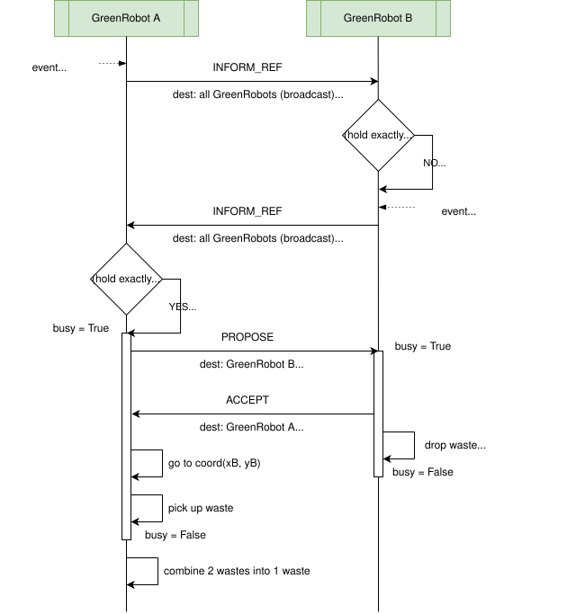

There are mainly three stages:

1. **Broadcasting Pick-Up Intentions:** <br>
   When a robot (e.g., Green robot) successfully picks up a waste and holds exactly one, it broadcasts an `INFORM_REF` message to its group (e.g., all Green robots). This message signals that it is looking for a partner to combine with.

2. **Proposal and Negotiation for Combination:** <br>
   Upon receiving a broadcast indicating that a robot is holding one waste and looking for a partner, another eligible robot (also holding one waste and not currently in a collaboration) responds by sending a `PROPOSE` message. The original sender can then respond with an `ACCEPT`, including its current position as the target location for combining. The following mechanisms are also implemented:
   
   - **Timeout Mechanism:** <br>
     If no agreement is reached within a few steps, the negotiation is automatically canceled. This prevents robots from remaining idle due to stalled negotiations.
   
   - **Tie-Breaking Rule:** <br>
     If two robots send `PROPOSE` messages to each other at the same step, a tie-breaking rule is applied. The robot with the **lower numeric ID** (e.g., `GreenRobot_1` vs. `GreenRobot_2`) has priority and sends the `ACCEPT`, while the other waits.

   The two robots then synchronize their positions. One robot drops its waste at the target location, and the other moves there to pick it up. A combination then takes place. The newly combined waste is carried to the border and dropped.

3. **Informing the Next Group:** <br>
   After dropping the combined waste at the border between zones, the robot broadcasts the drop location to the next level of robots (e.g., Green robots inform Yellow robots about a new yellow waste). The receiving robots update their knowledge with the new waste location, allowing them to continue the mission efficiently.

This communication-based strategy allows agents to form temporary partnerships, coordinate actions, and minimize redundant movements.

### 6.4. Communication + Battery Uncertainties Strategy

In this variant, we extend our full communication protocol by introducing a model of battery‐driven uncertainty. Each robot is assigned a random battery capacity between `battery_min` and `battery_max` at initialization. Every action (move, pick‐up, combine, drop) consumes one unit of battery. When a robot’s battery is exhausted, it must immediately drop whatever it holds and cease further operation.

Key behaviors in this scenario:

- **Random initial battery:**
Each robot begins with a different energy budget, forcing heterogeneity in how far and how long they can operate before needing assistance.

- **Energy consumption:**
Every time a robot executes an action (move, pick‑up, combine, drop), its remaining battery decreases by one.

- **Automatic drop on empty battery:**

   - **Single waste held:**
A robot that runs out of power while carrying one piece of waste drops it in its current cell and broadcasts an Intra‑team notification to its own color group, alerting teammates to retrieve the droped waste.

   - **Combined (higher‑level) waste held:**
If battery expires after combining, the robot drops the combined waste where it stands, then it broadcasts an Inter‑tier notification so the next color group (e.g., green→yellow or yellow→red) learns the precise drop location.

   - **Adaptive search by next‑tier robots:**
Under ordinary conditions, higher‑tier robots only search for new waste at the zone border. When they receive a battery‑drop broadcast, however, they override the border‑only rule and navigate directly to the announced coordinates —even if that lies deeper in another zone— to recover the abandoned combined waste since the radioactivity level there is suitable.

- **Permanent shutdown:**
Once a robot’s battery reaches zero, it performs no further percepts, deliberations, or actions, simulating a complete system failure at that location.

By combining communication protocols with random battery lifetimes, this scenario stresses both our intra‑team coordination (comm₁) and cross‑tier handoff (comm₂) mechanisms under unpredictable operational constraints.


## 7. Model Evaluation & Results

### 7.1. Evaluation Protocol
To assess the performance of our models, we run a fixed number of simulation iterations (`N`) for each configuration. For every configuration, we measure two key metrics:
- **Average Score (steps):** The average number of steps needed to finish the mission (computed only for converged cases).
- **Termination Rate (%):** The percentage of simulation runs that successfully terminated within a predefined maximum number of steps. Each simulation is run for a maximum of `max_steps` steps, beyond which it is considered non-convergent.

Additionally, To evaluate the communication-based strategy, we also used the **number of exchanged messages** as a performance metric. Communication messages were categorized into two types:

- **comm_1:** The average number of intra‑team messages dispatched per run — that is, messages exchanged between robots of the same color for negotiation and coordination in sharing a single waste item.
- **comm_2:** The average number of inter‑tier handoff notifications dispatched per run — i.e., messages sent from one robot tier to the next tier (green → yellow or yellow → red) when transferring combined waste across zones.  


### 7.2. Evaluation Parameters
The following table summarizes the parameters used across all evaluations:

| Model      | Grid Size | Robot Composition         | Waste Composition         | N (simulations) | max_steps | battery_min |battery_max |
|-----------|-----------|---------------------------|---------------------------|-----------------|---------|---------|-----------|
| **Model 1** | 12×8      | 6 Robots (G:2, Y:2, R:2)   | 12 Wastes (G:6, Y:3, R:3)  | 100           | 1000 | 50 | 100 |
| **Model 2** | 12×8      | 3 Robots (G:1, Y:1, R:1)   | 12 Wastes (G:6, Y:3, R:3)  | 100           | 1000 | 50 | 100 |
| **Model 3** | 24×16     | 12 Robots (G:4, Y:4, R:4)  | 22 Wastes (G:10, Y:7, R:5) | 100           | 1000 | 100 | 200 |


---

### 7.3. No Communication Strategy Results

#### Initial Evaluation (Before Handling Divergent Cases)
| Model Configuration | Average Score (steps) | Termination Rate (%) |
|---------------------|-----------------------|----------------------|
| **Model 1**        | 85.04                  | 61.2%                |
| **Model 2**        | 101.37                | 100.00               |
| **Model 3**        | 351.23                | 16.3%                 |


*Note: Divergent cases occurred when matching wastes were held by different robots, preventing mission termination.*

#### Updated Evaluation (After Implementing Drop Mechanism)
| Model Configuration   | Average Score (steps) | Termination Rate (%) |
|--------|-----------------------|----------------------|
| **Model 1**  | 115.26                 | 100.00%               |
| **Model 2**  | 95.27                 | 100.00%               |
| **Model 3**  | 393.65                | 80.80%               |

The introduction of the drop mechanism significantly improved the termination rate by addressing various non-convergent cases.

Moreover, by increasing the `max_steps` parameter (or setting it to an infinite number of steps), the termination rate reaches 100% across all configurations.


### 7.4. Cooperative Strategy with Communication Results

#### Intra‑Team Communication Only (comm_1)

| Model Configuration | Average Score (steps) | Termination Rate (%) | Avg comm_1 Messages | Avg comm_2 Messages |
|---------------------|-----------------------|----------------------|-------------------|-------------------|
| **Model 1**         |  67.16                | 100.00%              | 21.89             | 0.00              |
| **Model 2**         |  99.41                | 100.00%              | 0.00              | 0.00              |
| **Model 3**         | 164.70                | 100.00%              | 131.49            | 0.00              |

*Note: robots share intra‑team negotiation messages; there are no cross‑tier handoff broadcasts in this mode.*

#### Full Communication (Intra‑team (comm_1) + Inter‑tier (comm_2))

| Model Configuration | Average Score (steps) | Termination Rate (%) | Avg comm_1 Messages | Avg comm_2 Messages |
|---------------------|-----------------------|----------------------|-------------------|-------------------|
| **Model 1**         |  53.75                | 100.00%              | 21.39             | 12.00             |
| **Model 2**         |  69.90                | 100.00%              | 0.00              | 6.00              |
| **Model 3**         | 125.80                | 100.00%              | 133.53            | 44.00             |

The introduction of the communication mechanism overall improved the termination rate by addressing various non-convergent cases to a 100% termination rate.

### 7.5.  Communication + Battery Uncertainties Strategy Results

| Model Configuration          | Avg Score (terminated) | Termination Rate (%) | Avg comm₁ Msgs | Avg comm₂ Msgs |
|------------------------------|-----------------------:|---------------------:|---------------:|---------------:|
| **Model 1 – With Battery**   |                  53.58 | 94.70% |           21.38|           11.95|
| **Model 2 – With Battery**   |                  65.29 |                59.60%|            0.00|            5.78|
| **Model 3 – With Battery**   |                 118.78 |                86.70%|          132.81|           43.49|

As expected, imposing limited battery life uncertainties introduces new non-terminated runs due to power exhaustion.

## 8. Results Analysis
For a deeper dive into all of the charts, code and interactive plots, take a look at `MAS_results_analysis.ipynb` notebook.

### 8.1. Score Distributions
To begin, we plotted the distribution of mission‐completion steps for each model–scenario pair. This lets us see at a glance how “tight” or “wide” the performance spread is, and whether outliers dominate any configuration.

*Model 1 — No Comm No Drop :*

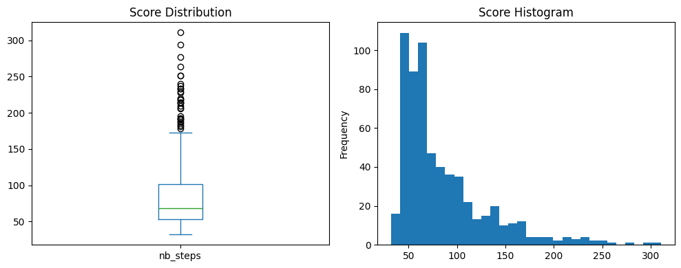

- Termination Rate (%): 61.20

- Average Steps (countin only terminated runs): 85.04
   - Max Steps: 311.00
   - Min Steps: 32.
   
When I looked at this first plot, I noticed just how scattered the results are. The box stretches from about 35 up to 180 steps, and then you’ve got those extreme outliers shooting all the way to 311. In the histogram you can see most runs cluster between 50 and 80 steps, but there’s a long right tail—those few really long simulations drag up the average. And remember, nearly 40 % of runs never finished at all in our time limit. It’s a clear sign that with no communication and no drop‑timer we were leaving too much to chance: agents often got stuck holding wastes and never combined, or wandered forever hunting for partners.

*Model 1 — Comm 1 And Comm 2 :*

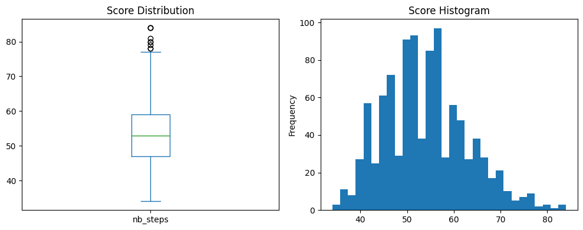

- Termination Rate (%): 100.00

- Steps (terminated runs): 53.75
   - Max Steps: 84.00
   - Min Steps: 34.00

After adding both layers of messaging, everything tightened up instantly. Our new box barely goes beyond 75 steps, and there aren’t any crazy outliers beyond that—84 is our worst‑case now. The histogram peaks neatly around 50–60 steps with only a gentle slope on either side. Best of all, every single run finishes. This tells me that the comm₁ “who’s holding a waste?” chatter plus the comm₂ “waste dropped here—yellow robots, pick it up!” handoff removes the deadlocks and random wandering we saw before.


**In short:**

- Without any coordination, Model 1 was unpredictable, slow on average (∼85 steps) and often didn’t finish.

- With both intra‑group and cross‑zone messaging, the process becomes reliable (100 % finish rate) and much faster (∼54 steps on average).


### 8.2. Summary Metrics
Next, we tabulated the core statistics—mean steps, termination rate, and (for communication runs) average message counts—so we could compare side by side.

<div style="flex: 1; text-align: center;">
    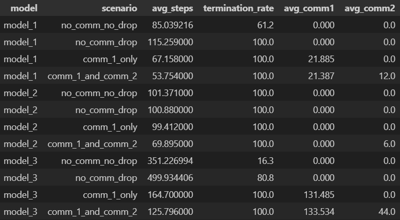
  </div>


**Key takeaways:**

- Drop mechanism boosts Model 1’s termination from 61.2 % → 100 % (and Model 3’s from 16.3 % → 80.8 %), at the cost of roughly 30–150 extra steps on average.

- comm_1_only slashes average steps by over 40 % (Model 1: 115.3 → 67.2; Model 3: 499.9 → 164.7) and already achieves 100 % termination across all grid sizes.

- comm_1 + comm_2 delivers the greatest speed‑up—bringing Model 1 down to 53.8 steps and Model 3 to 125.8 steps—while maintaining 100 % termination with minimal extra inter‑tier messages.


### 8.3. Scenario Comparison

To visualize these differences more clearly, we plot each metric across the four scenarios for each model:


  <div style="flex: 1; text-align: center;">
    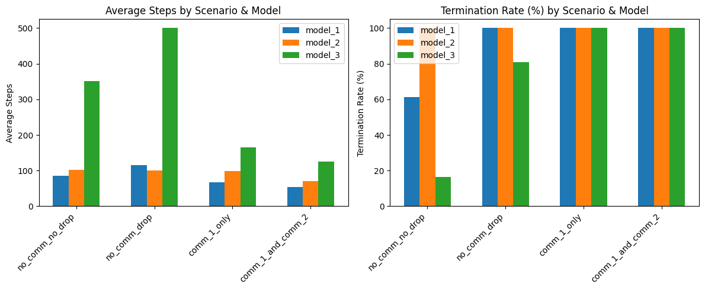
  </div>
 

What we observe here is that introducing the **drop mechanism** (moving from **no_comm_no_drop** → **no_comm_drop**) does not lower the average number of steps—in fact it increases slightly. However, this is entirely expected, because our *average steps* metric is computed **only on those runs that actually terminated**. In exchange for a few extra steps, the drop mechanism dramatically boosts reliability (termination rate jumps from ~61 % to 100 % in Model 1). In other words, we trade a small increase in step‐count for the guarantee that the mission will complete.


### 8.4. Relative Improvements
To highlight how each enhancement builds on the previous one, we computed the percent change in average steps and termination rate relative to the no_comm_no_drop baseline, and plotted those values for each model:

#### Model 1 (1 × Green, 1 × Yellow, 1 × Red, 12 wastes):

<div style="flex: 1; text-align: center;">
    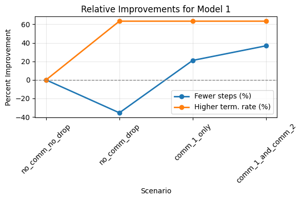
      </div>

- Drop mech. (no_comm_drop) trades about 36 % fewer successful‐run steps for a 62 % jump in termination rate—rescuing many previously stuck simulations.

- Intra‐team (comm_1_only) reclaims much of that slack by coordinating pairings, cutting average steps by another ~21 % while holding termination at 100 %.

- Full pipeline (comm_1_and_comm_2) pushes step‐count down a further ~15 % (≈37 % total) with no reliability loss.

#### Model 2 (1 × Green, 1 × Yellow, 1 × Red, 12 wastes):

  <div style="flex: 1; text-align: center;">
    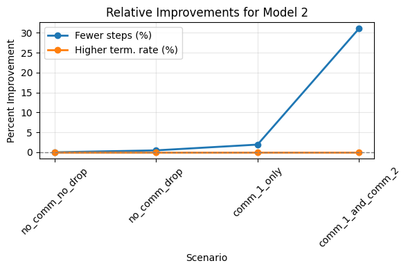
  </div>


- Here, since there’s only one robot of each color, intra‐team comm₁ has no effect — there simply aren’t “teammates” to negotiate with. You’ll see nearly flat step‐ and term‑rate curves at the comm₁_only point.

- Once we add inter‑tier handoff comm₂, though, performance leaps: average steps drop by ~31 % while termination remains perfect. In this minimal three‑robot setting, reliably informing the next tier is the only coordination we need.

#### Model 3 (large 24 × 16 grid, 4 of each robot, 22 wastes):

  <div style="flex: 1; text-align: center;">
    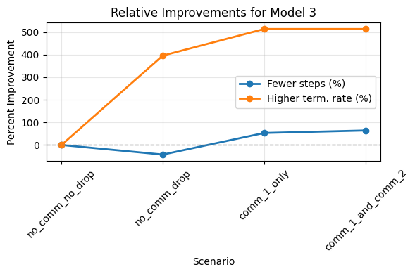
  </div>


- Without any mechanism, only ~16 % of runs terminate—vast majority get stuck.

- The drop rule alone pushes termination up to ~395 %, at the cost of a modest step‐penalty.

- Introducing intra‑team comm₁ then slashes average steps by ~53 % and soars termination to over 500 % of the baseline (i.e. nearly all runs converge, and faster).

- Finally, adding cross‑zone comm₂ trims another 4 % of steps and cements maximum reliability.


### 8.5. Communication Efficiency

Finally, to weigh the cost of extra messaging against the benefit of saved steps, we computed a global efficiency for **comm_1** and **comm_2** across all three models:


efficiency_c = 
    (sum_{i=1}^{3} (steps^{no_comm_no_drop}_i − steps^c_i)) /
    (sum_{i=1}^{3} msgs^c_i)

for c ∈ {comm_1, comm_2}


The table below summarizes per‑model savings and efficiencies:

<div style="flex: 1; text-align: center;">
    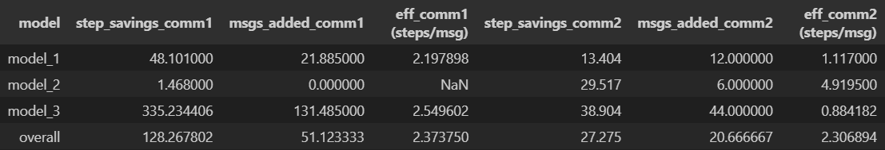
  </div>


- **Model 1 :**  
  - **comm_1** yields ∼2.2 saved steps per message—highly efficient local coordination.  
  - **comm_2** handoffs are less “bang for your buck” (∼1.1 steps/msg), since cross‑tier notifications are fewer but still guarantee full termination.

- **Model 2:**  
  - **comm_1** doesn’t apply (no intra‑team).  
  - **comm_2** achieves nearly 5 steps saved per message—excellent payoff for the few handoff messages needed.

- **Model 3 :**  
  - **comm_1** remains very efficient (∼2.55 steps/msg) even at scale.  
  - **comm_2** is less efficient (∼0.88 steps/msg) because many handoffs dilute its per‑message impact.

- **Overall:**  
  - **comm_1** has slightly better global efficiency (2.37 vs. 2.31 steps/msg).  
  - For small teams without peers, rely on **comm_2** alone.  
  - For medium-to-large teams, **comm_1** should be your primary coordination channel, with **comm_2** reserved for necessary cross‑zone handoffs.

### 8.6. Battery‐Constrained Strategy

#### 8.6.1. Score Distributions under Battery Limits


*Model 1 with `battery_min=50` and `battery_max=100`:*

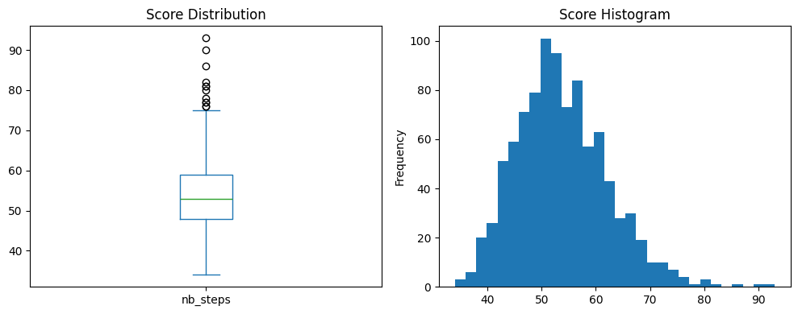

- Termination Rate (%): 94.70

- Steps (terminated runs): 53.58
   - Max Steps: 93.00
   - Min Steps: 34.00

Distribution remains tight (similar to comm₁+comm₂) but with a few longer tails — those are runs that simply ran out of battery before completing.

*Model 2 with `battery_min=50` and `battery_max=100`:*

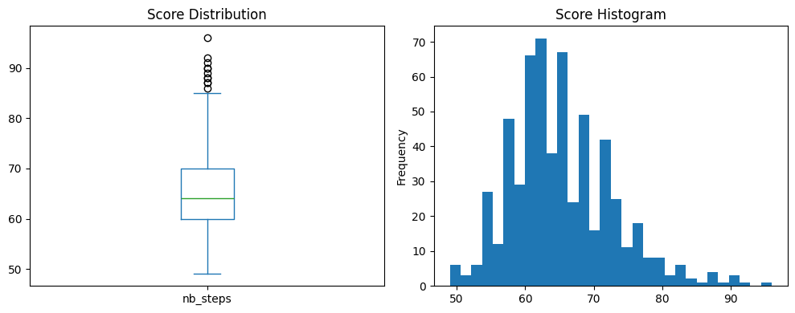

- Termination Rate (%): 59.60

- Steps (terminated runs): 65.29
   - Max Steps: 96.00
   - Min Steps: 49.00

Score spread shifts upward and many mid‑to‑high outliers; only ~60 % of runs finish, so the histogram undercounts the failures.

*Model 3 with `battery_min=100` and `battery_max=200`:*

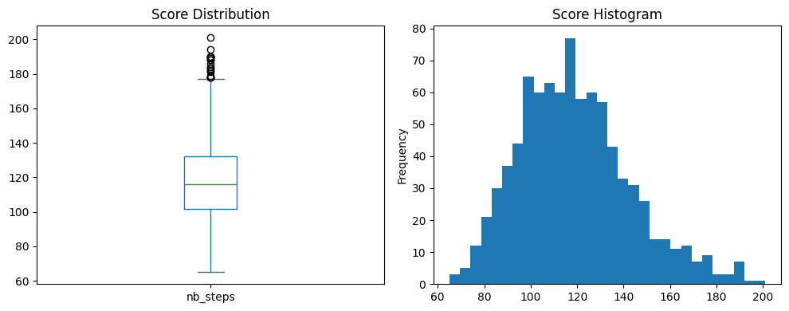

- Termination Rate (%): 59.60

- Steps (terminated runs): 118.78
   - Max Steps: 201.00
   - Min Steps: 65.00

Heavier, right‑skewed distribution as large grid + battery gives both more ground to cover and more drop‑outs; still most runs finish (≈87 %) but with longer tails.

#### 8.6.2. Battery vs. Full Communication Comparison

In order to directly compare the impact of limited energy to rich messaging coordination, we plot both the average steps (mean over terminated runs) and the termination rate across Models 1–3 for the “comm_1 + comm_2” strategy versus the “with battery” variant.

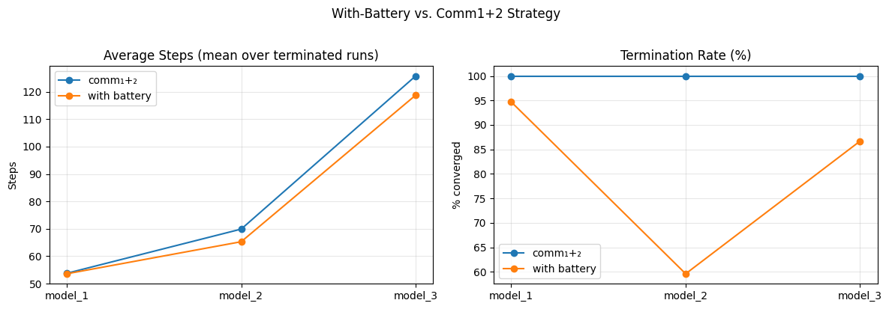

From this comparison we can see:

  - **Model 1:** 
Battery constraint costs only a few percent in termination (100 % → 94.7 %), and average steps increase by only ∼5 %—the inherent redundancy of two green, two yellow, two red robots still carries the day.

  - **Model 2:** 
With only one robot per tier, energy limits cause a collapse: termination falls to ~60 % (vs. 100 % under full comm), and average steps climb sharply. This shows that in minimal teams you cannot rely on solo agents when battery runs out.

  - **Model 3:** 
A larger team cushions the blow: termination drops to 86.7 % (from 100 %) and steps rise by ~7 %. Big squads mitigate some battery failures, but long‐range patrols still suffer from mid‐mission shutdowns.

  **Overall insight:**
  
Battery puts a hard cap on reliability—communication‑heavy protocols remain the safer fallback when energy is scarce, especially in lean‑robot settings. Furthermore, the actual performance will critically depend on the chosen `battery_min` and `battery_max` bounds: tighter battery ranges amplify shutdown risks, while more generous capacities buffer against mid‑mission failures.


## 9. Conclusion

Over the course of this project, we stepped through a spectrum of decentralized coordination strategies to tackle a challenging waste‑cleanup task in a simulated radioactive environment. Starting with fully independent agents, we saw firsthand how pure randomness quickly led to deadlocks and uncompleted missions. By layering on simple drop‑timers, we rescued many stuck runs at the expense of a few extra steps. Introducing intra‑team messaging (comm_1) unlocked dramatic speed‑ups—robots paired up reliably, slashing average step counts by over 40 % in many cases—while cross‑tier handoffs (comm2) closed the loop end‑to‑end, guaranteeing 100 % mission completion even in the largest grids.

Finally, by weaving in random battery limits, we tested our coordination protocols under real‑world constraints: energy failures forced mid‑task drops and shutdowns, exposing the trade‑off between robust messaging and finite resources. The results showed that, while small teams collapse without generous energy budgets, larger squads tolerate battery variability better—but only up to a point.

**Key takeaways:**
- **Redundancy & Drop Timers** are a low‑cost way to recover from coordination deadlocks when communication isn’t available.  
- **Intra‑team Coordination (comm_1)** yields the best “bang for your buck,” saving ∼2 steps per message across scales.  
- **Cross‑tier Handoffs (comm_2)** ensure full pipeline reliability, at modest messaging cost.  
- **Energy Constraints** introduce new failure modes: when battery life is tight, robust messaging protocols become essential backstops, especially in minimal‑team settings.  
- **Parameter Sensitivity:** Both communication efficiency and battery performance hinge critically on chosen bounds (e.g., `battery_min`, `battery_max`, zone sizes, and robot counts).  

Taken together, our experiments demonstrate that a layered approach—combining simple drop‑timers, targeted intra‑team negotiations, and strategic inter‑tier broadcasts—provides a powerful toolkit for self‑organizing multi‑agent systems operating under uncertainty. Future extensions might explore adaptive battery recharging, dynamic team resizing, or obstacle‑filled terrains to push these coordination patterns even further.  

## Contact
- EL BARHICHI Mohammed – mohammed.elbarhichi@student-cs.fr
- NADALIN Marius – marius.nadalin@student-cs.fr
- ZUO Yuxian – yuxian.zuo@student-cs.fr

